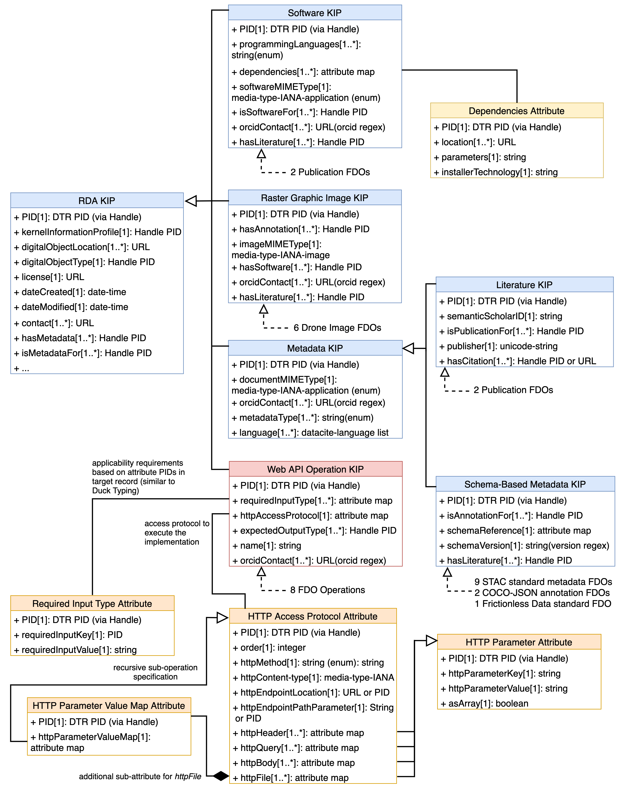

# Reference Implementation for an FDO Service Architecture using DOIP
## Abbreviations:
- KIP: Kernel Information Profile
- TPM: Typed PID Maker
- PID: Persistent Identifier
- FDO: FAIR Digital Object
- DOIP: Digital Object Interface Protocol
- DTR: Data Type Registry

## To reproduce the results, carry out the following steps (you will need to have Docker installed and running):
- clone this repository
- navigate to the local folder and start the docker compose stack using ```docker compose build```
- after building, start the containers using ```docker compose up```
- when the containers are running and the spring build is finished, register the extended FDO records using the shell script with (assuming mac): ```chmod +x ./ingest_fdos.sh``` and then ```./ingest_fdos.sh --post --dir extended_records```
- run the test_tpm.ipynb cells to sequentially print out the results (further described in the following)
## FDO records
We duplicated and extended the FDO records of the PIDs available at https://zenodo.org/records/7022736. The original records are stored under [original_records](flask_app1/original_records). The extended records are available at [extended_records](extended_records) and were only registered locally using  sandbox PIDs, not at Handle as the original ones which can be resolved at https://hdl.handle.net/ using the PIDs in the referenced JSON files. The extended records were created using additional Kernel Information Profiles (KIPs) and Attribute Types that are registered at the ePIC testing DTR (https://dtr-test.pidconsortium.net/), namely:
- KIPs: 
    - Web API Operation KIP(inherits from RDA KIP): https://dtr-test.pidconsortium.net/#objects/21.T11148/ea4e93d06a10e15d9cdf
    - Raster Graphic Image KIP(inherits from RDA KIP): https://dtr-test.pidconsortium.net/#objects/21.T11148/0e76292794888d4f1fa7
    - Schema-based Metadata Profile(inherits from Metadata KIP that inherits from RDA KIP): https://dtr-test.pidconsortium.net/#objects/21.T11148/2c3cafa4db3f3e1e51b3
    - Literature KIP(inherits from Metadata KIP that inherits from RDA KIP): https://dtr-test.pidconsortium.net/#objects/21.T11148/f17e27f97a710780997d
    - Software KIP(inherits from RDA KIP): https://dtr-test.pidconsortium.net/#objects/21.T11148/492b70a6e479de37eecb
- Attribute Types:
    - Operation Name: https://dtr-test.pidconsortium.net/#objects/21.T11148/90ee0a5e9d4f8a668868
    - Required Input Type: https://dtr-test.pidconsortium.net/#objects/21.T11148/2694e4a7a5a00d44e62b
    - Expected Output Type: https://dtr-test.pidconsortium.net/#objects/21.T11148/f5c452794e258e83e4ad
    - HTTP Access Protocol: https://dtr-test.pidconsortium.net/#objects/21.T11148/a1fe3f60497302ae8b04
    - ORCiD Contact (inherits from Contact): https://dtr-test.pidconsortium.net/#objects/21.T11148/df4aab1aaf6c1cd41a70
    - Has Annotation (inherits from Has Metadata): https://dtr-test.pidconsortium.net/#objects/21.T11148/210acdb71caa2e4c55cc
    - Document MIME Type: https://dtr-test.pidconsortium.net/#objects/21.T11148/77e7da3320d24e21008b
    - Schema Reference: https://dtr-test.pidconsortium.net/#objects/21.T11148/49330041ca5fddf9af92
    - Container MIME-Type: https://dtr-test.pidconsortium.net/#objects/21.T11148/007fb75612859ed30aa0
    - Language: https://dtr-test.pidconsortium.net/#objects/21.T11148/43fd02fd11bca92e7b37
    - Semantic scholar Id: https://dtr-test.pidconsortium.net/#objects/21.T11148/01bdb13fcd6d26156cf2
    - Publisher: https://dtr-test.pidconsortium.net/#objects/21.T11148/b497a0aad7d4c7179b4f
    - Is Publication For (inherits from Is Metadata For): https://dtr-test.pidconsortium.net/#objects/21.T11148/ca2ebad82c2c5a100182
    - Has Citation (inherits from Has Metadata): https://dtr-test.pidconsortium.net/#objects/21.T11148/2d4d83f729fc8c3483b5
    - Programming Language: https://dtr-test.pidconsortium.net/#objects/21.T11148/fa7511b19d58efa10f2a
    - Dependencies: https://dtr-test.pidconsortium.net/#objects/21.T11148/495117c3604f83ec4b52
    - Is Software For: https://dtr-test.pidconsortium.net/#objects/21.T11148/b9665c62fe864b1a34e5
    - Software MIME Type: https://dtr-test.pidconsortium.net/#objects/21.T11148/03aa494d265c86505051
    - Has Literature (inherits from hasMetadata): https://dtr-test.pidconsortium.net/#objects/21.T11148/7a320ca3fff18b3310df
    - Metadata Type: https://dtr-test.pidconsortium.net/#objects/21.T11148/ab70492fe8b6b8bf8a6b

These attributes are present on the first level of the information record and some have sub-types introduced by inheritance and compoistion as specified in the DTR. Lower-level attribute structures are represented as string values (expected by the TPM validator) but reflect a JSON structure that is reconstructed in the TPM_Adapter module. The new types can be validated by the TPM instance, configured with the ePIC DTR by default. The following image shows the modelling diagram in UML style for the KIPs and Attribute Types:



## The software package comprises three main modules:
- [TPM_Adapter()](flask_app2/tpm_adapter.py): provides a client interface by exposing an endpoint .../doip that implements the Digital Object Interface Protocol for HTTP clients. Typically uses the interface of the Typed PID Maker (TPM) Service avialable at https://github.com/kit-data-manager/pit-service.
Implements service specific operations for FDOs, namely:
    - LIST_OPS(): lists all FDO Operations and service operations using the TPM interface
    - LIST_FDOS(): lists all FDOs using the TPM interface
    - GET_FDO(): retrieves the information record associated with the Persistent Identifier of a FDO using the TPM interface
    - FDO_Operation*(): performs the operation described by a FDO Operation for an associated target FDO using the Mapping_service and Executor
- [Mapping_Service()](flask_app2/fdo_fdops_mapping.py): recieves the access protocol of a FDO Operation record (currently only HTTP supported) and the targeted FDO record. Transfers the parameters in the access protocol into (HTTP) requests and adds them to the workflow map. Values for parameter keys are either provided in the FDO Operation record directly (for standard values), are referenced via an attribute key in the target record from where they are mapped, or are passed by the client using the PID of the parameter key and are then directly inserted. In case multiple values per attribute key are present in the target FDO record and the asArray statement for the parameter states False,
 a separate request per value is added to the map. Otherwise, the values are mapped as one list. The module also considers recursive patterns when sub-operations are described and finally sorts the workflow map according to the record description which is theb returned.
- [Executor()](flask_app2/execute_request.py): Recieves the workflow map containing the requests to execute the described operation(s) (currently only HTTP requests for Web APIs supported). Returns the resuls to the TPM_Adapter which sends it to the client.
## DOIP request examples for service and FDOs
In the following, example HTTP/DOIP requests and responses are provided for each FDO Operation (including service and external operations) with an example target. All requests follow a unifrom structure where the operationId query argument specifies the identifier of the FAIR Digital Object Operation and targetId the FAIR Digtial Object or serviceID this operation is applied to. By default, a request is made using the GET method, and if additional attributes are passed in the request body, the POST method is used. In case additional attributes are passed, they must refer to one of the HTTP parameter elements, specified in the FDO record of the applied operation and must therefore be passed using the PID of the respective Attribute Type (example EVALUATE_LICENSE that takes the PID of the *httpQuery* attribute). This is typically the case when information needs to be passed by the client and is not available in the record of a targeted FDO. These results can be reproduced for all reference FDO records following the instructions in the earlier section.

- **LIST_OPS (for service ops)**: Lists all operations that are implemented by the service
    *Request*:
    ```
    GET .../doip?operationId=0.DOIP/Op.LIST_Ops&targetId=service
    Content-Type: appliaction/json;charset=utf-8
    ```
    *Response*:
    ```
    HTTP/1.1 200 OK
    Content-Type: application/json;charset=utf-8
    Content-Length: ...

    {
    "available service operations": {
        "0.DOIP/Op.*": {
            "arguments": "*",
            "operationID": "Object",
            "response type": "JSON object or encoded binary data",
            "targetID": "Object"
        },
        "0.DOIP/Op.GET_FDO": {
            "arguments": "None",
            "operationID": "0.DOIP/Op.GET_FDO",
            "response type": "PID record",
            "targetID": "Object"
        },
        "0.DOIP/Op.LIST_FDOs": {
            "arguments": "None",
            "operationID": "0.DOIP/Op.LIST_FDOs",
            "response type": "array of FDO PIDs",
            "targetID": "Service"
        },
        "0.DOIP/Op.LIST_Ops": {
            "arguments": "None",
            "operationID": "0.DOIP/Op.LIST_Ops",
            "response type": "map of service operation specifications or map of supported FDO Operations for the target object",
            "targetID": "Service or Object"
        }
    }
- **LIST_FDOS**: lists all FDOs registered in the the configured TPM instance
    *Request*:
    ```
    GET .../doip?operationId=0.DOIP/Op.LIST_FDOs&targetId=service
    Content-Type: appliaction/json;charset=utf-8
    ```
    *Response*:
    ```
    {
      "available FDOs": [
        {
          "created": "2024-04-09T10:49:01.567743Z",
          "modified": "2024-04-09T10:49:01.567743Z",
          "pid": "sandboxed/fa798f80-a6db-4ce5-aab2-03188abd80aa"
        },
        {
          "created": "2024-04-09T10:49:01.567744Z",
          "modified": "2024-04-09T10:49:01.567744Z",
          "pid": "sandboxed/abbb8d8a-5ca0-4bc2-9386-47a2aae94244"
        },
        ...
        ]
    }
    ```
- **GET_FDO**: retrieves the information record associated with the Persistent Identifier of a FDO using the TPM interface
    *Request*:
    ```
    GET .../doip?operationId=0.DOIP/Op.GET_FDO&targetId=sandboxed/PID1
    Content-Type: appliaction/json;charset=utf-8
    ```
    *Response*:
    ```
    {
    "pid": "sandboxed/8182a503-fb72-4167-a9d3-c3813cb270bc",
    "entries": {
      "21.T11148/076759916209e5d62bd5": [
        {
          "key": "21.T11148/076759916209e5d62bd5",
          "value": "21.T11148/2c3cafa4db3f3e1e51b3"
        }
      ],
      "21.T11148/1c699a5d1b4ad3ba4956": [
        {
          "key": "21.T11148/1c699a5d1b4ad3ba4956",
          "value": "21.11152/3052e4f1-4dd6-4c40-9a16-0a6b5f409e4a"
        }
      ],
      "21.T11148/2f314c8fe5fb6a0063a8": [
        {
          "key": "21.T11148/2f314c8fe5fb6a0063a8",
          "value": "https://creativecommons.org/licenses/by/4.0/"
        }
      ],
      ...
      }
    }
    ```
- **LIST_OPS (for a FDO)**: lists all FAIR Digital Object Operations associated with a FDO and registered at the TPM instance
    *Request*:
    ```
    GET .../doip?operationId=0.DOIP/Op.LIST_Ops&targetId=sandboxed/PID1
    Content-Type: appliaction/json;charset=utf-8
    ```
    *Response*:
    ```
    HTTP/1.1 200 OK
    Content-Type: application/json;charset=utf-8
    Content-Length: ...
    
    {
      "available FDO Operations": [
        {
          "name": "EVALUATE_LICENSE",
          "pid": "sandboxed/49d302da-b977-42eb-8643-e4d3a391bab3"
        },
        {
          "name": "FIND_METADATA",
          "pid": "sandboxed/547c8a14-17aa-45dc-8ac5-7642cbb5c312"
        },
        ...
      ]
    }
    ```
- **EVALUATE_LICENSE**: Evaluates the license given in a FDO record based on the criteria of open- or non-open access (using regex for input argument), with "21.T11148/916ca3badfa68b06870c" as the request argument for the required value input by the client for the query parameter. 
    *Request*:
    ```
    POST .../doip?operationId=sandboxed/PID1&targetId=sandboxed/PID2
    Content-Type: appliaction/json;charset=utf-8
    
    {
    "21.T11148/916ca3badfa68b06870c": "open source",
    }
    ```
    *Response*:
    ```
    HTTP/1.1 200 OK
    Content-Type: application/json;charset=utf-8
    Content-Length: 4

    true
    ```
- **GET_ORCID**: Retrieves the profile of an ORCiD using the official ORCiD Web API.
    *Request*:
    ```
    GET …/doip?operationId=sandboxed/PID1&targetId=sandboxed/PID2
    Content-Type: application/json;charset=utf-8
    ```
    *Response*:

    ```HTTP/1.1 200 OK
    Content-Type: application/json;charset=utf-8
    Content-Length: ...

    {
        "orcidId": "0000-0002-9082-9095",
        "personalInformation": {
            "name": {
            "givenNames": ...
        ...
    }
    ```
- **FIND_METADATA**: Retrieves the information record of FDOs that are referenced as metadata objects in the target FDO record. 
    *Request*:
    ```
    GET .../doip?operationId=sandboxed/PID1&targetId=sandboxed/PID2
    Content-Type: appliaction/json;charset=utf-8
    ```
    *Response*:
    ```
    HTTP/1.1 200 OK
    Content-Type: application/json;charset=utf-8
    Content-Length: ...

    [
        {
            "pid": "21.11152/09cb76fc-b8cb-4116-a22a-68c5bdfa77b0",
            "entries": {
                "21.T11148/b8457812905b83046284": [
                    {
                        "key": "21.T11148/b8457812905b83046284",
                        "value": "https://zenodo.org/record/6517768/files/Flug1_100_stac_spec.json?download=1"
                    }
                ],
            ...
        },
        {
            "pid": "21.11152/7b58b3b5-75eb-4417-ac4d-abe025e159f6", 
            ...
        }
      }
    ]
    ```
- **FIND_ANNOTATION**: Retrieves the information record of FDOs that are referenced as annotation objects in the target FDO record.
    *Request*:
    ```
    GET .../doip?operationId=sandboxed/PID1&targetId=sandboxed/PID2
    Content-Type: appliaction/json;charset=utf-8
    ```
    *Response*:
    ```
    HTTP/1.1 200 OK
    Content-Type: application/json;charset=utf-8
    Content-Length: ...

    [
        {
            "pid": "21.11152/6ea60288-d895-414e-80c0-26c9fdd662b2",
            "entries": {
                 "21.T11148/b8457812905b83046284": [
                    {
                        "key": "21.T11148/b8457812905b83046284",
                        "value": "https://zenodo.org/record/6517768/files/Flug1_100-104Media_coco.json?download=1"
                    }
                ],
            ...
            }
        }
    ]
    ```
- **FIND_SOFTWARE**: Retrieves the information record of FDOs that are referenced as software objects in the target FDO record.
    *Request*:
    ```
    GET .../doip?operationId=sandboxed/PID1&targetId=sandboxed/PID2
    Content-Type: appliaction/json;charset=utf-8
    ```
    *Response*:
    ```
    HTTP/1.1 200 OK
    Content-Type: application/json;charset=utf-8
    Content-Length: ...

    [
        {
            "pid": "21.11152/4212db18-38ce-4d4c-9fcc-f1e01de37bda",
            "entries": {
                 "21.T11148/b8457812905b83046284": [
                    {
                        "key": "21.T11148/b8457812905b83046284",
                        "value": "https://github.com/Helmholtz-AI-Energy/TBBRDet/archive/refs/heads/main.zip"
                    }
                ],
            ...
            }
        }
    ]
    ```
- **FIND_LITERATURE**: Retrieves the information record of FDOs that are referenced as literature objects in the target FDO record.
    *Request*:
    ```
    GET .../doip?operationId=sandboxed/PID1&targetId=sandboxed/PID2
    Content-Type: appliaction/json;charset=utf-8
    ```
    *Response*:
    ```
    HTTP/1.1 200 OK
    Content-Type: application/json;charset=utf-8
    Content-Length: ...

    [
        {
            "pid": "21.11152/0e37227a-e418-4430-a52e-24baad82f965",
            "entries": {
                 "21.T11148/b8457812905b83046284": [
                    {
                        "key": "21.T11148/b8457812905b83046284",
                        "value": "https://doi.org/10.1016/j.autcon.2022.104690"
                    }
                ],
            ...
            }
        }
    ]
    ```
- **RECOMMEND_LITERATURE**: Uses the Semantic Scholar ID attribute in the target FDO record to query recommended literature from the the official Semantic Scholar API.
    *Request*:
    ```
    GET .../doip?operationId=sandboxed/PID1&targetId=sandboxed/PID2
    Content-Type: appliaction/json;charset=utf-8
    ```
    *Response*:
    ```
    HTTP/1.1 200 OK
    Content-Type: application/json;charset=utf-8
    Content-Length: ...
    
    {
        "paperId": "481ea9ca37dd2d1b1884d48b42fb9f142b75c163",
        "title": "Building Precision: Efficient Encoder\u2013Decoder Networks for Remote Sensing Based on Aerial RGB and LiDAR Data"
    },
    {
        "paperId": "c33e14a9c59fa98edd409b78d4b5d4c9f4aece1f",
        "title": "ACMFNet: Attention-Based Cross-Modal Fusion Network for Building Extraction of Remote Sensing Images"
    },
    ...
    
    ```
- **VALIDATE_SCHEMA**: Recieves a JSON metadata document and corresponding JSON schema reference to validate the compliance between document and schema.
    *Request*:
    ```
    GET .../doip?operationId=sandboxed/PID1&targetId=sandboxed/PID2
    Content-Type: appliaction/json;charset=utf-8
    ```
    *Response*:
    ```
    HTTP/1.1 200 OK
    Content-Type: application/json;charset=utf-8
    Content-Length: ...

    true
    ```
- **GET_THUMBNAIL**: Recieves a container file containing image data and returns a zip folder with the images in png format.
    *Request*:
    ```
    GET .../doip?operationId=sandbox/PID1&targetId=sandbox/PID2
    Content-Type: appliaction/json;charset=utf-8
    ```
    *Response*:
    ```
    HTTP/1.1 200 OK
    Content-Type: image/png
    Content-Disposition: attachment; filename="{target_pid}.png"
    Content-Length: ...
    ETag: "abcd1234"

    <binary data>
    ```
